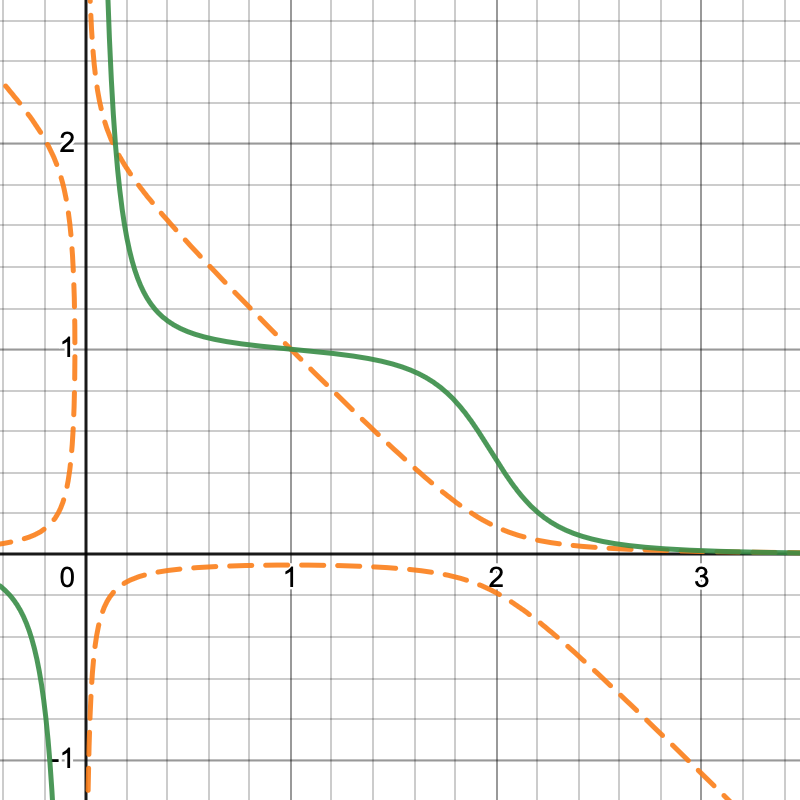
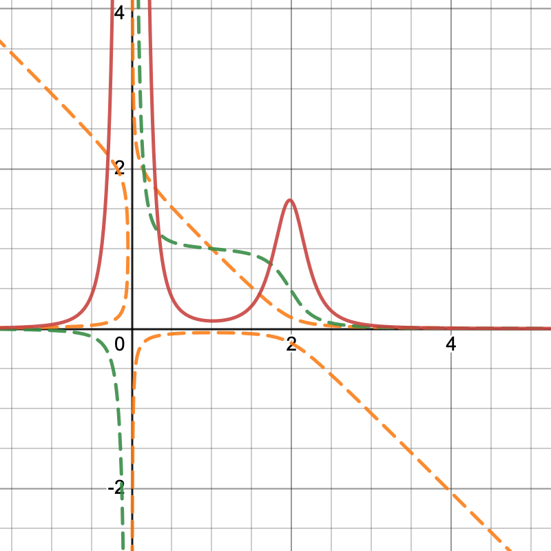

# y2k prep

Goals for audit are:

1. Cost of attack analysis with oracle manipulation
2. Strike price analysis
3. Insurance pricing mechanism analysis


## Background

y2k materials:

- y2k [docs](https://y2k-finance.gitbook.io/y2k-finance/)
- y2k [whitepaper](https://www.docdroid.net/7zgCd3R/y2k-whitepaper-pdf)

After initial review of docs, seems that y2k is effecitvely a [binary option](https://en.wikipedia.org/wiki/Binary_option) platform,
currently offering puts on stablecoin depeg events.

Existing markets offered on depeg events for:

- MIM: `K = 0.9759`
- USDC: `K = 0.9979`
- USDT: `K = 0.9919`
- FRAX: `K = 0.9909`
- DAI: `K = 0.9969`


## Pricing Mechanism

Pricing mechanism for option sellers ("Risk vault" depositors) seems like biggest risk to system (economic attack vector)
as option buyers ("Hedge vault" depositors) can place as little down as possible in premium to buy the option.
i.e. Risk vault depositors are effectively quoting the ask for the put at $0 to start, when no hedge vault depositors exist.
This is a massive mispricing of risk.

An example to illustrate:

 - Seller deposits $1M in risk vault to underwrite depeg insurance
 - Buyer deposits $0.01 in hedge vault to buy the associated depeg insurance *on $1M payout*
 - If depeg occurs, buyer receives $1M + $0.01 back. Seller loses entire principal.


## Oracles

MIM is likely the riskiest of all assets offered, reflected in the lower strike price set.

### MIM

Analytics dashboards

- [Overview](https://analytics.abracadabra.money/overview)
- [Cauldrons](https://analytics.abracadabra.money/cauldrons)

#### CDPs (as of 2022-11-22; analytics dashboard)

Borrows:
 - $61.45M of MIM borrowed as stable rate loans
 - $31.04M of MIM borrowed as non-stable (variable) rate loans
 - **$92.49M of MIM borrowed (total)**

Collateral:
 - $71.21M of collateral backing stable rate loans
 - $86.74M of collateral backing non-stable (variable) rate loans
 - **$157.95M of collateral (total)**

Collateral Profile (top positions):
 - $34.82M of cvxtricrypto2 for $20.82M MIM loan (1.6724x overcollateralization ratio)
 - $36.25M of yvWETH v2 for $11.21M MIM loan (3.234x overcollateralization ratio)

So have $92.49M MIM outstanding in circulating supply. Where is most of this liquidity? (almost all on Ethereum)

#### Balances (as of 2022-11-22; etherscan)

[MIM Token](https://etherscan.io/token/tokenholderchart/0x99d8a9c45b2eca8864373a26d1459e3dff1e17f3)

1. 457.672M in anyMIM (anyswap) contract: wasn’t this hacked?
2. 115.069M in a [“CauldronOwner” contract](https://etherscan.io/address/0x30b9de623c209a42ba8d5ca76384ead740be9529#code)
3. 58.930M in [Curve Metapool with MIM and 3Crv](https://etherscan.io/address/0x5a6a4d54456819380173272a5e8e9b9904bdf41b) (majority of liquidity)
4. 45.755M in [Abracadabra Multisig](https://etherscan.io/address/0x5f0dee98360d8200b20812e174d139a1a633edd2)
5. 4.090M in [Abracadabra Degenbox](https://etherscan.io/address/0xd96f48665a1410c0cd669a88898eca36b9fc2cce#code) (didn't this die with USDT? there's other collateral in there tho)
6. 1.290M in single random degen in an [EOA](https://zapper.fi/account/0xd7efcbb86efdd9e8de014dafa5944aae36e817e4) (seems like big risk; if user dumped in Curve pool, how much would price move?)
7. 0.767M in Sushiswap [BentoBox V1](https://etherscan.io/address/0xf5bce5077908a1b7370b9ae04adc565ebd643966)
8. 0.688M in [Gemini 4](https://etherscan.io/address/0x5f65f7b609678448494de4c87521cdf6cef1e932)
15. 0.200M in [Bitfinex: Hot Wallet](https://etherscan.io/address/0x77134cbc06cb00b66f4c7e623d5fdbf6777635ec)
16. 0.175M in [SushiSwap: MIM 2 Pool (MIM/WETH)](https://etherscan.io/address/0x07d5695a24904cc1b6e3bd57cc7780b90618e3c4)
20. 0.06976M in [Uni V3: USDD-MIM Pool (J Sun)](https://etherscan.io/address/0x1d64947ff4cecb87a3c4aae6e668f9d312fa71b3)

**TL;DR**
- 63.72% of circulating supply of MIM is in the single [Curve Metapool](https://curve.fi/#/ethereum/pools/mim/deposit), so any price changes will happen through this pool
- Should try to look at which sources Chainlink uses, as *maybe* could get away with a large swap on Sushi for a short period of time that sways price. But very likely an easy arb through Curve pool
- Manipulation calculations should likely be moving the Curve pool

#### Curve Metapool (MIM)

Curve materials

- [Curve Read The Docs](https://curve.readthedocs.io/toctree.html)
- [Curve Metapool Docs](https://curve.readthedocs.io/exchange-deposits.html#metapool-deposits)
- [Curve WPs](https://classic.curve.fi/whitepaper) (see StableSwap; i.e. V1)
- [Understanding Curve V1](https://resources.curve.fi/base-features/understanding-curve)
- [Base & MetaPools](https://resources.curve.fi/lp/base-and-metapools)
- [Metapool templates](https://github.com/curvefi/curve-contract/tree/master/contracts/pool-templates/meta)
- [Metapool Swap `exchange_underlying`](https://github.com/curvefi/curve-contract/blob/master/contracts/pool-templates/meta/SwapTemplateMeta.vy#L640) (enables swapping through base pool)

Full notes writeup on Curve V1 pools is [here](https://hackmd.io/@fmrmf/B17f2lTLo).

Stableswap invariant

```
A * n**n * sum_i x_i + D = A * D * n**n + D**(n+1) / (n**n * prod_i x_i)
```

[Curve balance chart (x, y)](https://www.desmos.com/calculator/zye4mzkim0)


[Curve marginal price chart (x, P(x))](https://www.desmos.com/calculator/ox7d71h8ud)



[Curve marginal slippage chart (x, S(x))](https://www.desmos.com/calculator/ruj2cgyfu1)



#### Potential manipulation attack vectors

Think through the following manipulation attack:

1. Purchase binary put via Y2K
2. Wait until vault deposits close
3. Mint MIM via abracadabra through overcollateralized loan
4. Dump MIM for USDC/USDT/DAI in Curve 3 pool
5. Hold other stables
6. Trigger depeg event via Curve pool
7. Claim insurance payout via Y2K
8. Swap USDC/USDT/DAI back for MIM
9. Repay MIM loan

```
PnL for attack = Y2K payout - Y2K premium - Slippage on Curve
```

**When is this attack worth it for attacker (PnL > 0)?**

From the simple [Curve MIM metapool plots](https://www.desmos.com/calculator/mrvj4vjixu) using [`A = 2000`](https://curve.fi/#/ethereum/pools/mim/swap),
one can see the strike price of `K = 0.9759` will be breached when approximately 96.5% of the pool is composed of MIM.

Will conservatively estimate the attack ignoring any buffers placed by Chainlink. Since their docs are rather opaque, seems safer to simply assume
they relay the price directly from Curve, particularly given 63.72% of MIM supply is in the Curve pool anyway. Tuning Y2K risk parameters under
these more conservative assumptions (i.e. assuming worst case for Chainlink), means robustness in the event price manipulation attack does happen
regardless of unknown Chainlink procedures.

The pool is composed of (as of 2022-11-26)
- 58.812M MIM (60.28%)
- 38.748M 3Crv (39.71%)

For a MIM price = 0.9998943101028948.

**Some rough numbers below:**

To reach the strike of 0.9759 given current `A = 2000`, the pool must be composed of ~96.5% MIM. For a current `D = 98.3823M`,
need to sell approximately 40M of MIM into the pool to breach strike price. Can confirm via [UI](https://curve.fi/#/ethereum/pools/mim/swap).

Worst case slippage on 40M MIM would be `2 * (1 - 0.976) = 0.048` or 4.8% on the 40M, which is 1.92M as a loss due to slippage (factor of 2 due to sell then buy back). 
Would then need Y2K payout less premium fees to be >= 1.92M to make this manipulation even worth it to explore (ignoring ETH -> stablecoin slippage on Y2K payout).
MIM risk vaults currently have deposits [of > $2.258M](https://dune.com/queries/1503953/2532529), so this attack would be possible if not
for borrow caps on [Abracadbra](https://abracadabra.money/markets/) being faully exhausted.

*WARNING: must monitor CDP caps on MIM and loan amounts to confidently offer MIM puts*


**Mitigations for this attack:**
- Caps on Y2K risk vault deposits as a function of liquidity in Curve pool, enforcing PnL < 0 for attack (issue here is Curve liquidity can change during deposit period)
- Rough numbers for conservative cap on MIM risk vault is around ~ $1.92M (*TODO: check and move away from rough*), given existing Curve MIM pool conditions (as of 2022-11-26). Conservative as it assumes worst-case scenario with Chainlink (simply forwarding Curve price)
- Should monitor CDP caps on MIM in the event of new large loans being offered by Abracadbra as the larger the caps on Abracadabra, the more likely this manipulation attack can be executed
- Further, fix Y2K premium pricing mechanism (i.e. significant slippage for larger put option size)


## References

Binary options / volcano bonds:

- https://en.wikipedia.org/wiki/Binary_option
- https://riskcenter.wharton.upenn.edu/wp-content/uploads/2021/07/Cat-Bond-Primer-July-2021.pdf
- https://www.investopedia.com/terms/b/binary-option.asp
- https://www.chicagofed.org/publications/chicago-fed-letter/2018/405

