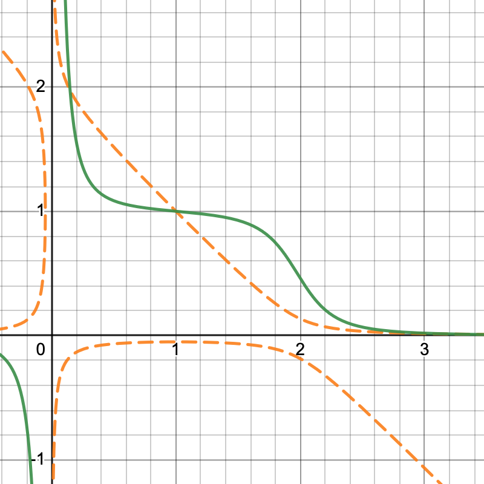
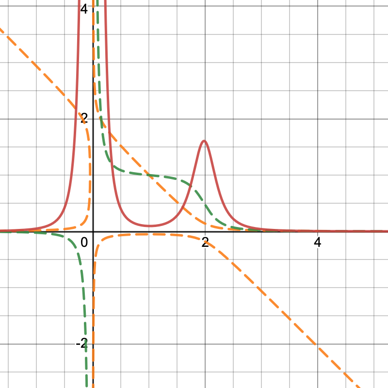
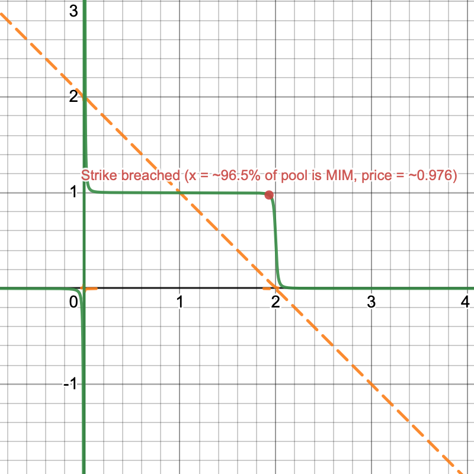

# Oracle Manipulation

Oracle manipulation analysis.


## TL;DR

- ~62% of MIM circulating supply and the majority of liquidity for the token
is in the MIM Curve metapool
- Meaning, price discovery should occur solely through this lone pool, making it an easy target for price manipulation
- An attacker could purchase a Y2K put on MIM, mint MIM through Abracadabra, sell into the Curve pool to trigger a depeg,
collect on Y2K and repay the MIM loan
- Upfront capital required to execute this attack is ~52M USD given current liquidity conditions on the MIM Curve metapool
- Slippage lost on Curve, however, would only be ~230K USD
- The attack is **not** currently possible due to borrow caps on Abracadabra being fully exhausted
- Y2K should consider implementing caps on risk vault deposits at or near this Curve slippage loss amount
to completely eliminate the profitability of this attack in the event Abracadabra increases new borrows in the future


## Background

Y2K currently offers binary option markets on depeg events for the stablecoins

- MIM: `K = 0.9759`
- USDC: `K = 0.9979`
- USDT: `K = 0.9919`
- FRAX: `K = 0.9909`
- DAI: `K = 0.9969`

paired against USD, with strike `K` specified for each market.

MIM is likely the riskiest of all markets offered, reflected in the lower strike
price set by the protocol.

Focus for the oracle manipulation analysis was on MIM given the increased risks
to option sellers of this market.


## Risks with the MIM Curve Metapool

Users of Abracadbra can mint MIM through a CDP mechanism, with the loan
backed by various collateral types. Analytics dashboards for MIM are provided
by Abracadabra:

- [Overview](https://analytics.abracadabra.money/overview)
- [Cauldrons](https://analytics.abracadabra.money/cauldrons)

breaking down outstanding supply, borrows, collateral, and collateral profile.

An overview as of 2022-12-04,

- ~85M MIM of total borrows (i.e. MIM circulating supply)
- ~154M USD worth of collateral backing

with the majority of activity (~97.5%) on Ethereum mainnet.

However the top holders of MIM on Ethereum are heavily concentrated
in a few addresses, with **~62% of the circulating supply in the MIM Curve Metapool**.

To understand the liquidity distirbution of MIM, several relevant top
holders from [Etherscan's MIM Token page](https://etherscan.io/token/tokenholderchart/0x99d8a9c45b2eca8864373a26d1459e3dff1e17f3)
are listed below:

1. 472.016M in anyMIM contract
2. 115.069M in a [CauldronOwner contract](https://etherscan.io/address/0x30b9de623c209a42ba8d5ca76384ead740be9529)
3. 53.217M in [Curve Metapool with MIM and 3Crv](https://etherscan.io/address/0x5a6a4d54456819380173272a5e8e9b9904bdf41b)
4. 30.724M in [Abracadabra Multisig](https://etherscan.io/address/0x5f0dee98360d8200b20812e174d139a1a633edd2)
5. 5.892M in [Abracadabra Degenbox](https://etherscan.io/address/0xd96f48665a1410c0cd669a88898eca36b9fc2cce#code)
6. 1.290M in a single [EOA](https://zapper.fi/account/0xd7efcbb86efdd9e8de014dafa5944aae36e817e4)
7. 0.795M in Sushiswap [BentoBox V1](https://etherscan.io/address/0xf5bce5077908a1b7370b9ae04adc565ebd643966)
8. 0.688M in [Gemini 4](https://etherscan.io/address/0x5f65f7b609678448494de4c87521cdf6cef1e932)
15. 0.200M in [Bitfinex: Hot Wallet](https://etherscan.io/address/0x77134cbc06cb00b66f4c7e623d5fdbf6777635ec)
16. 0.183M in [SushiSwap: MIM 2 Pool (MIM/WETH)](https://etherscan.io/address/0x07d5695a24904cc1b6e3bd57cc7780b90618e3c4)
20. 0.022M in [Uni V3: MIM-USDC Pool](https://etherscan.io/address/0x298b7c5e0770d151e4c5cf6cca4dae3a3ffc8e27)

As the majority of the liquidity for MIM lies in the single Curve metapool,
price discovery for MIM vs USD will likely happen through this pool. This
is a significant risk for Y2K when offering markets on MIM, as price manipulation
of this lone pool by a large MIM holder will likely be difficult to arbitrage
back due to insignificant liquidity on other major DEXs and CEXs. This should also affect
*any* oracle reporting MIM price due to the significant concentration of circulating supply
in the Curve pool, regardless of the buffers put in place.

**NOTE:** The analysis around Curve pool manipulation below will take a conservative approach and assume the worst-case
scenario of the Chainlink oracle relaying price directly from the Curve pool (but no flashloan attacks),
as Chainlink docs can be opaque w.r.t. MIM.


## Manipulating the Curve Pool to Trigger Depegs

### Curve Math

[Curve metapools](https://curve.readthedocs.io/exchange-deposits.html#metapool-deposits)
are pools paired with an underlying base pool's LP token. In the case of MIM, the
base pool is the Curve [3pool](https://curve.fi/#/ethereum/pools/3pool/swap)
composed of DAI, USDC, and USDT.

Some notes on Curve V1 pools are provided [here](https://hackmd.io/@fmrmf/B17f2lTLo)
for context. The general takeaway is the Curve pool acts like a [superposition](https://www.desmos.com/calculator/zye4mzkim0)
of a constant product pool $\prod_i x_i = (D / n)^n$ with a constant sum pool $\sum_i x_i = D$.

The differences with constant product are most extreme near the equilibrium point of balanced reserves (i.e. price = 1),
where the [marginal price curve](https://www.desmos.com/calculator/ox7d71h8ud)
$P_{ij} = -dx_i / dx_j$ flattens out



Green is marginal price $P(x)$ as a function of $x$ reserves, orange-dotted is the Curve invariant plotted w.r.t. coin balances $(x, y)$.
Only looking at the two-coin case for simplicity.

The tradeoff made by the Curve pool is significantly less slippage when reserves are balanced,
but extreme slippage once significant imbalance occurs (i.e. price goes to zero rapidly). This is
easiest to see from the [marginal slippage chart](https://www.desmos.com/calculator/ruj2cgyfu1)
$S_{ij} = -dP_{ij}/dx_j$



Red is marginal slippage $S(x)$ as a function of $x$ reserves, green-dotted is the marginal price, orange-dotted is the Curve invariant.

Slippage is near zero when balanced, but increases rapidly as imbalance occurs.

### Attacking The Curve Pool

An attacker could use the MIM Curve metapool to manipulate the price of MIM vs USD
in their favor, so as to trigger a depeg event on the MIM Y2K binary put oracle.
The oracle manipulation attack goes as follows:

1. Purchase binary put via Y2K on MIM
2. Wait until Y2K vault deposits close
3. Mint MIM via Abracadabra CDP
4. Sell MIM for USDC/USDT/DAI through the MIM Curve metapool
5. Oracle reports price below strike `K` due to sell, triggering depeg event on Y2K
6. Claim insurance payout via Y2K
7. Sell USDC/USDT/DAI for MIM through same MIM Curve metapool
8. Repay MIM loan from Abracadabra

The PnL for this attack is

```
PnL for attack = Y2K payout - Y2K premium - Slippage on Curve
```

where the calculation for how much the attacker loses to slippage on Curve
uses the context from the prior section. Using parameters from the MIM Curve metapool
[in this plot](https://www.desmos.com/calculator/mrvj4vjixu) as an estimate



roughly shows the pool breaks below the Y2K strike price when MIM makes up ~96.5% of the pool balances.

### Cost of Attack

Cost of attack for manipulating the MIM Curve metapool is the minimum amount of upfront MIM capital needed
to sell into the pool for the price on Curve to dip below the Y2K strike of `K=0.9759`.

This can be found by inverting the marginal price function $x = P^{-1}(P)$ and taking the delta
between the current price $P_0$ and the target strike price $K$

```math
\Delta x = P^{-1}(K) - P^{-1}(P_0)
```

where $x$ is in units of MIM.

Since Curve math isn't super nice to work with, an easier approach taken in the provided
[oracle manipulation notebook](../notebook/oracle-manipulation.ipynb) is to simply try many values
for $\Delta x$ in the known function $P(x + \Delta x)$ until the output is very near to the strike price.

To be even more rigorous, the provided [oracle manipulation script](../scripts/curve_manipulation.py)
deploys in mainnet-fork a new mock Curve V1 pool with the current MIM metapool parameters. Mock tokens are minted
to this pool to replicate the current liquidity conditions in the actual metapool. The script
generates in a [csv file](../scripts/results/curve_manipulation.csv) the results of executing this attack against
the mock pool for various input sizes sold into the pool. To run, execute from the base directory

```sh
hatch run ape run curve_manipulation
```

As of 2022-12-04,

- **~47M MIM mint via Abracadabra** is required to manipulate the Curve pool to the strike price of 0.9759
- **>52M USD of upfront collateral for CDP** assuming a maximum collateral ratio of 90% for cauldron of choice
- **~230K MIM is lost to slippage** from executing the attack

Any payout from Y2K less fees and premium that is greater than ~230k USD will make this attack worthwhile to try.
Though, there are inherent risks in whether or not the Chainlink oracle relays the price post-swap as well as arbs.


## Mitigating Curve Pool Attacks

Y2K MIM risk vaults currently have deposits [of > $2.258M](https://dune.com/queries/1503953/2532529), so this attack would be potentially profitable if not
for borrow caps on [Abracadabra](https://abracadabra.money/markets/) being fully exhausted.

Mitigations for this attack that Y2K should consider are below.

### Caps on Y2K Risk Vault Deposits

Caps on Y2K risk vault deposits as a function of current liquidity in the Curve pool would enforce PnL < 0 for this attack
by limiting the maximum payout the attacker would receive from Y2K. Given current conditions,
this risk vault cap on MIM would be rather low, however, at ~230K USD.

### Monitor CDP Caps on Abracadabra

CDP caps on Abracadabra for minting new MIM should be constantly monitored when offering MIM binary puts.
The possibility of new large loans being offered by Abracadabra increases the risk of this attack being executed profitably.

### Price Insurance via Bonding Curve

The Y2K premium pricing mechanism does not rely on a bonding curve. Therefore, there is no explicit slippage mechanism
to deter larger players from buying greater pro-rata rights to the risk vault deposits in the event of a depeg. Increased
slippage for greater size would deter this manipulation attack by eating into the Y2K portion of the payout in the PnL expression
above. [The insurance pricing analysis](./insurance-pricing.md) goes into further detail for the Y2K premium pricing mechanisms.

